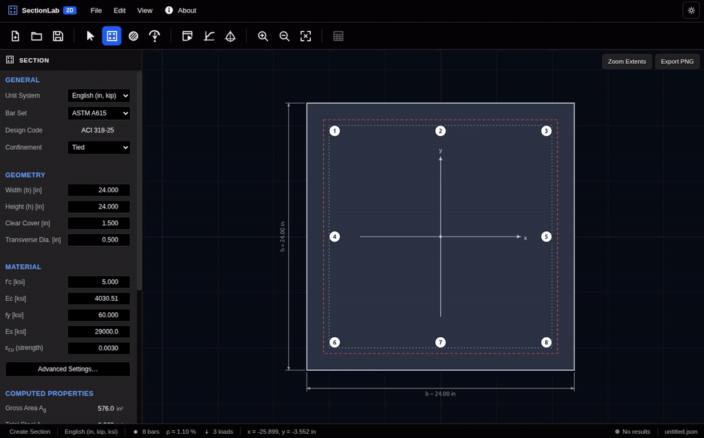

# SectionLab 2D

**SectionLab 2D** is a browser-based reinforced-concrete **cross-section analysis** tool built as a single HTML application with HTML, CSS, and vanilla JavaScript. It uses strain compatibility and equilibrium to evaluate rectangular reinforced-concrete sections under axial force with uniaxial or biaxial bending, and provides interactive section editing, strength-interaction diagrams, nonlinear moment-curvature response, demand checks, and engineering report generation — all client-side, with no server, installation, or build step.

The strength-analysis interface is organized around **ACI 318-25** provisions, while the application explicitly identifies provisions that have not been independently verified against the ACI CODE-318-25 standard. The nonlinear moment-curvature calculation is a separate analytical fiber-section model and is **not** an ACI code check.

Created by **Danilo S. Kusanovic**, Assistant Professor of Teaching, Civil and Environmental Engineering, University of California, Davis.

## Features

- Interactive rectangular reinforced-concrete section editor with a CAD-style canvas.
- Define section width, height, clear cover, transverse reinforcement diameter, concrete strength, steel strength, and elastic moduli.
- Tied or spiral confinement selection for strength-reduction calculations.
- ASTM A615 and CSA G30.18 reinforcement bar sets.
- Add, move, duplicate, mirror, delete, and arrange reinforcing bars interactively.
- Automatic perimeter and linear reinforcement layouts.
- Geometry and reinforcement checks for bars outside the section, overlapping bars, cover, spacing, and reinforcement ratio.
- Assign multiple factored **P-Mx-My** force-moment demand points.
- Nominal and factored **P-Mx** and **P-My** interaction diagrams.
- **Mx-My** biaxial capacity contours at a selected axial-force level.
- Interactive **3D P-Mx-My capacity surface** with nominal and factored envelopes.
- Biaxial demand/capacity checks using the factored Mx-My contour at the applied axial load.
- Nonlinear analytical **moment-curvature** response about the x- and y-axes at constant axial force.
- Moment-curvature event tracking including first cracking, first steel yield, peak response, and ultimate state when reached.
- Dark and light themes.
- English and SI display units, switchable at any time.
- Save/Open complete models as JSON files.
- Import and export force-moment demand points as CSV.
- Export reinforcement, interaction curves, Mx-My contours, 3D capacity-surface data, moment-curvature results, and result tables to CSV.
- Export the active section or result view as PNG.
- Generate a multi-page PDF engineering report with section geometry, reinforcement, diagrams, demand checks, warnings, assumptions, material models, code references, and solver settings.
- Undo/redo support and automatic stale-result tracking after model changes.
- Built-in developer self-test for units, section properties, axial limits, interaction symmetry, demand classification, moment-curvature behavior, UI structure, and report prerequisites.

## Getting Started

SectionLab 2D is contained in a single HTML file. Plotly.js, jsPDF, and jsPDF-AutoTable are loaded from public CDNs, so an internet connection is required when those libraries are not already cached by the browser.

1. Download or clone this repository.
2. Keep `UCD_Section_Analyzer-UI.html` and `section-analyzer-demo.gif` in the repository folder.
3. Open [`UCD_Section_Analyzer-UI.html`](UCD_Section_Analyzer-UI.html) directly in a modern desktop browser such as Chrome, Edge, or Firefox.
4. No build tools, package managers, local database, or application server are required.
5. Start with the included default 24 in × 24 in tied-column example and press **F9** or click **Run Analysis** to compute the results.

> Tip: some browsers restrict downloads or other features for pages opened through `file://`. If that occurs, serve the folder locally, for example with `python3 -m http.server`, and then open `http://localhost:8000/UCD_Section_Analyzer-UI.html`.

## Interface Overview

| Area | Description |
|---|---|
| **Menu bar** (top) | `File` for model I/O and exports, `Edit` for undo/redo and reinforcement/load editing, `View` for result tables and display options, plus the About and theme controls. |
| **Toolbar** (below menu bar) | Quick access to New/Open/Save, Select, Create Section, Add Bars, Force-Moment Pairs, Run Analysis, Moment-Curvature, Axial-Moment Interaction, zoom controls, and PDF report generation. |
| **Properties panel** (left) | Context-sensitive controls for section properties, reinforcement, loads, moment-curvature settings, and interaction-diagram options. |
| **Viewport** (center) | Displays the section drawing or the active Plotly result view, including moment-curvature, P-M interaction, Mx-My contours, and the 3D capacity surface. |
| **Status bar** (bottom) | Displays the active tool, unit system, bar count, reinforcement ratio, load count, analysis status, progress, and current file name. |

## Quick Tutorial: Analyze a Reinforced-Concrete Column Section

This is the basic workflow demonstrated in the GIF above:

1. **Define the section.** Open the **Section** view and enter the width, height, clear cover, transverse reinforcement diameter, material strengths, and confinement type.
2. **Place reinforcement.** Open **Add Bars**, choose a bar size, and click inside the section to place bars. You can also generate a perimeter layout or add a linear bar layout.
3. **Review geometry.** Check the computed steel area, reinforcement ratio, section properties, bar centroid, minimum clear spacing, and any geometry or detailing warnings.
4. **Define demand points.** Open **Assign Force-Moment Pair** and enter one or more factored combinations using `Pu`, `Mux`, and `Muy`.
5. **Run the analysis.** Click **Run Analysis** or press `F9`.
6. **Inspect moment-curvature.** Open the **Moment-Curvature** view and select `κ-Mx`, `κ-My`, or both. A constant axial force can be prescribed for the fiber analysis.
7. **Inspect strength interaction.** Open **Axial-Moment Interaction** and switch among `P-Mx`, `P-My`, `Mx-My`, and `3D`.
8. **Check demand points.** Select a demand point to compare it with the factored biaxial capacity contour at the same axial-force level.
9. **Export results.** Save the model as JSON, export data tables or curves to CSV, export the active view as PNG, or generate the full PDF report.

## Analysis Methods

### Strength Interaction

The strength kernel uses strain compatibility and force equilibrium with an equivalent rectangular concrete compression block. Reinforcing bars are evaluated at their actual coordinates, and nominal section resultants are computed over neutral-axis orientations and depths.

The application produces:

- Uniaxial nominal and factored `P-Mx` interaction envelopes.
- Uniaxial nominal and factored `P-My` interaction envelopes.
- Biaxial `Mx-My` capacity contours at prescribed axial force.
- Full nominal and factored `P-Mx-My` capacity surfaces.
- Factored demand-point checks against the biaxial envelope.

The nominal envelope is calculated first. Strength-reduction factors are applied point-by-point to form the factored envelope, and the maximum design axial-compression cap is applied to the factored envelope only.

### Moment-Curvature

Moment-curvature is calculated with a one-dimensional fiber discretization through the section depth while enforcing a prescribed constant axial force.

The implemented analytical model includes:

- Hognestad-type parabolic-linear concrete compression response.
- Optional concrete tension behavior: neglected, elastic to modulus of rupture and then zero, or linear softening.
- Bilinear reinforcing-steel response with optional strain hardening.
- Concrete crushing and reinforcement terminal-strain limits.
- A bracketed equilibrium solution with guarded Newton acceleration.
- Positive and negative bending branches about both principal section axes.

This calculation is intended as an analytical section-response model and is **not an ACI 318 code check**.

## Units & Sign Convention

Internally, all physical quantities are stored in canonical **N-mm-MPa** units. Unit conversion occurs only at the display/export layer, so switching units does not alter the stored model or invalidate otherwise current results.

Available display systems are:

- **English:** in, kip, ksi, with moments displayed in kip-ft or kip-in.
- **SI:** mm, kN, MPa, with moments displayed in kN·m.

The section coordinate and force conventions are:

- `+x` to the right.
- `+y` upward.
- Origin at the gross-concrete centroid.
- `P > 0` = axial compression.
- Positive `Mx` produces tension at the **top** face (`+y`).
- Positive `My` produces tension at the **left** face (`-x`).

The same convention is used by the analysis kernels, drawings, plots, tables, CSV exports, and PDF report.

## Saving, Loading & Exporting

- **Save Model** / **Save Model As...** downloads the complete model as a `.json` file.
- **Open Model** restores a previously saved SectionLab 2D JSON model.
- **Import CSV** in the Force-Moment Pair editor imports demand rows in the form `Name, Pu, Mux, Muy[, color, visible]`.
- **Export CSV** can export reinforcement, demand points, interaction curves, Mx-My contours, 3D capacity-surface data, moment-curvature data, and result tables.
- **Export Active View (PNG)** exports either the section drawing or the currently displayed result plot.
- **Generate PDF Report** creates a multi-page engineering report directly in the browser using jsPDF and jsPDF-AutoTable.

The PDF report is enabled only when the model is valid and the analysis results correspond to the current model revision.

## Keyboard Shortcuts

| Key | Action |
|---|---|
| `Ctrl+N` | New model |
| `Ctrl+O` | Open model |
| `Ctrl+S` | Save model |
| `Ctrl+Shift+S` | Save model as |
| `Ctrl+Z` | Undo |
| `Ctrl+Y` | Redo |
| `Ctrl+P` | Generate PDF report |
| `Ctrl+T` | Open result tables |
| `Ctrl+E` | Zoom extents |
| `1` | Section view |
| `2` | Moment-Curvature view |
| `3` | Axial-Moment Interaction view |
| `G` | Toggle grid |
| `S` | Toggle grid snap |
| `B` | Toggle bar numbers |
| `U` | Switch unit system |
| `T` | Toggle light/dark theme |
| `F9` | Run analysis |
| `Delete` / `Backspace` | Delete selected reinforcing bars |
| `Esc` | Close an open dialog or return to Select |

## Model Validation & Result State

SectionLab separates the editable model from the analysis result state.

Any change to geometry, materials, reinforcement, demand points, or numerical analysis settings increments the model revision and marks existing results as **stale**. Stale results remain visible but are explicitly identified and cannot be used to generate the PDF report until the analysis is run again.

Before analysis, the program checks for issues such as:

- Invalid section dimensions or material properties.
- Missing longitudinal reinforcement.
- Reinforcing bars outside the concrete section.
- Overlapping bars.
- Cover and clear-spacing warnings.
- Reinforcement-ratio warnings.
- Selected strength parameters outside expected ranges.

## Developer Self-Test

A built-in test suite is available under:

**View → Run Developer Self-Test...**

The tests check, among other items:

- English/SI unit-conversion round trips.
- Gross rectangular section properties.
- Default reinforcement area and ratio.
- Pure axial tension and compression limits.
- Factored axial-cap behavior.
- Symmetry of a square, doubly symmetric section.
- Demand points inside, on, and outside the factored capacity envelope.
- Moment-curvature symmetry, cracking, yielding, terminal conditions, and fiber refinement.
- Required toolbar/UI structure.
- Plotly/jsPDF report prerequisites.

This is useful when modifying the source because the application is intentionally distributed as one self-contained HTML file.

## Engineering Limitations

SectionLab 2D analyzes a **short, prismatic, solid rectangular reinforced-concrete cross section** under axial force with uniaxial or biaxial bending.

It does **not** currently perform:

- Column slenderness or second-order analysis.
- Moment magnification.
- Service-load analysis.
- Shear or torsion design.
- Seismic or confinement detailing.
- Development or splice-length checks.
- Bar-bundling checks.
- Member stability analysis.
- Circular or arbitrary polygonal sections.
- Sections with openings.
- Automatic reinforcement design.

The moment-curvature concrete model is unconfined; no confined-concrete constitutive law is implemented.

## Verification Notice

This application is intended for **educational and investigation use**.

The source itself states that the ACI provisions used by the program were implemented from ACI 318-19 text available through secondary sources and published revision summaries rather than being independently verified directly against the ACI CODE-318-25 standard. Some provisions are explicitly marked **UNVERIFIED** in the application and in generated reports.

Results must therefore be independently checked before being used for professional engineering design or construction.

## Attribution

Created by **Danilo S. Kusanovic**  
Assistant Professor of Teaching  
Department of Civil and Environmental Engineering  
University of California, Davis

Third-party libraries loaded via CDN:

- [Plotly.js](https://plotly.com/javascript/) — interactive 2D/3D plots and PNG export.
- [jsPDF](https://github.com/parallax/jsPDF) — client-side PDF generation.
- [jsPDF-AutoTable](https://github.com/simonbengtsson/jsPDF-AutoTable) — tabular PDF report content.

No specific open-source license is declared inside `UCD_Section_Analyzer-UI.html`; if this repository is intended for public distribution or reuse, add an explicit `LICENSE` file.
